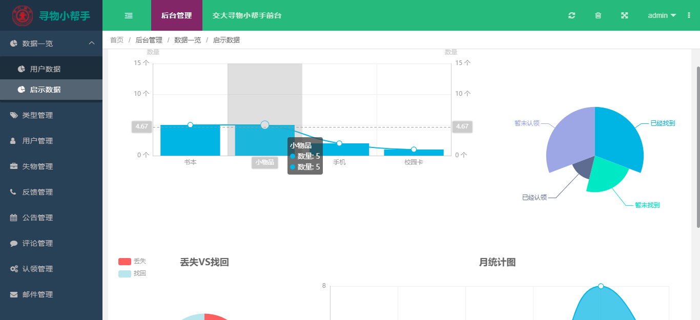
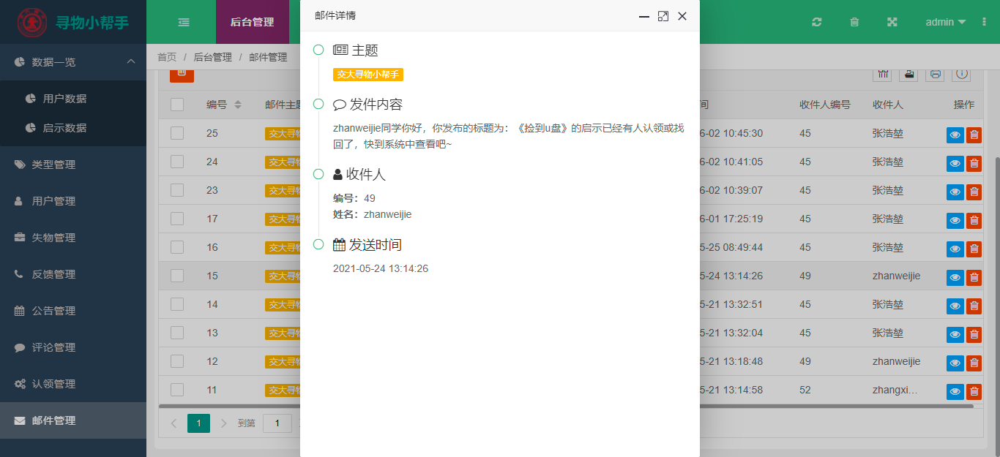
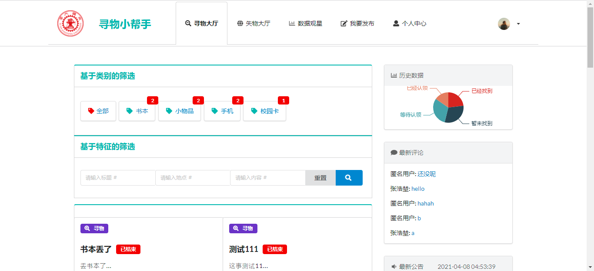
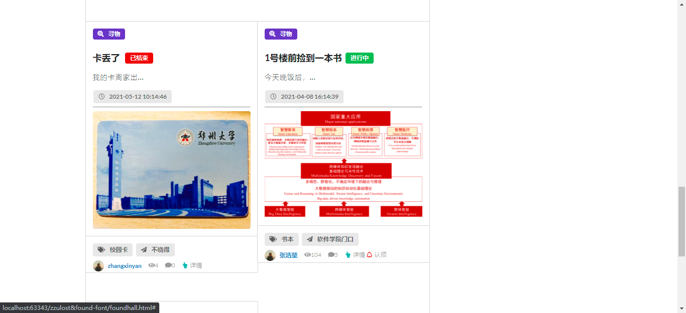

# 寻物小帮手--基于SpringBoot的设计与实现

> 作者：[zhanghaok](https://github.com/zhanghaok)
> 类型项目[任务打卡demo--类似于ToDolist此类的软件](https://github.com/zhanghaok/dailytask)
> 时间：2021年4月-5月

## 开发环境

IDEA+Webstorm

前后端分离开发

## 项目简介

> 后端利用springboot框架结合了mybatis数据持久化框架技术，前端页面套用LayUI模板，运行axios与后台服务器进行交互。开发的时候采用前后端分离的开发方式，即前端和后端开发互不干涉。

### 后台管理系统

主要功能：数据一览、用户管理、邮件管理、物品管理、评论管理......

图片部分展示

### 用户端

主要功能：失物寻物大厅、收件箱、发布启事、评论、查看详情、认领......

图片

## 特点

（1）多条件组合检索。在寻物模块中，设计了两种高级筛选，多条件的组合查询能更精确的帮助用户找到最优解。

（2）隐私性选项。在回复评论时可以选择匿名，以此保护用户隐私。

（3）邮件任务。使用基于Jmail的邮件服务，及时通知发布者，保证了寻物的时效性。

（4）数据分析。对用户和启示数据进行统计并可视化，能使得用户直观快速地掌握本平台的各项指标。

（5）基于类别关键字的关联性推荐 。本平台采用基于类别关键字的关联性推荐功能，多方位满足用户需求，尽可能帮助失主寻回物品。

## 如何运行

git clone 本项目

解压后，用IDEA打开zzullost&found项目文件夹

用WebStorm打开zzullost&found-font项目文件夹

先运行后端，在允许前端就可以愉快的进入系统啦~~~

## 一些开发过程中的笔记

[见文件夹开发笔记](https://github.com/zhanghaok/LostAndFoundSystem/tree/main/%E6%88%91%E7%9A%84%E9%A1%B9%E7%9B%AE%E5%BC%80%E5%8F%91%E7%AC%94%E8%AE%B0)

## 最后欢迎star♥♥~~

如果你有任何问题，请3250514239@qq.com联系我~~~

## 数据库脚本忘记放啦，邮件联系我发哟~

